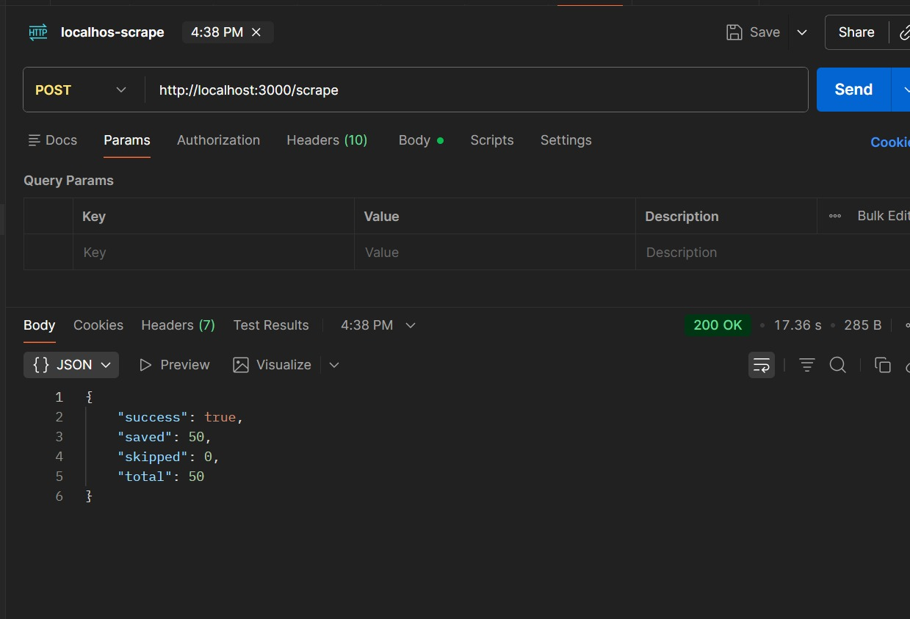
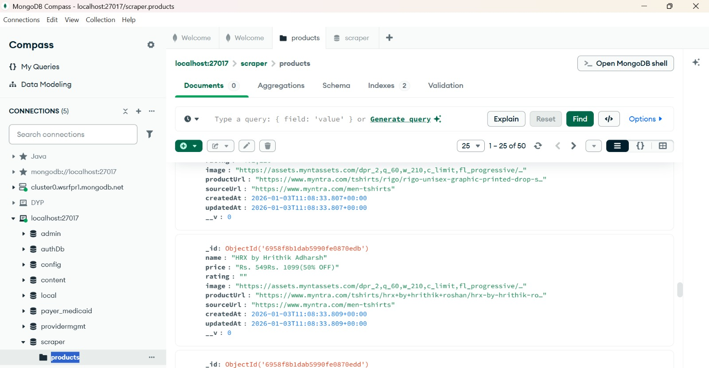

# Product Scraper API

A web scraping application that extracts product information from e-commerce websites (like Myntra) and stores them in MongoDB. This application provides a RESTful API to scrape product data and retrieve stored products.

## What This Application Does

This Product Scraper application:

- **Extracts Product Data**: Uses Puppeteer to scrape product information from e-commerce websites
- **Captures Product Details**: Extracts product name, price, rating, image URL, product URL, and source URL
- **Stores in MongoDB**: Saves scraped products to MongoDB with automatic duplicate prevention
- **Provides REST API**: Offers HTTP endpoints to trigger scraping and retrieve stored products

## 📸 Local Testing Results

### API Request/Response



Successfully scraped 50 products from Myntra using a POST request to `http://localhost:3000/scrape`. The API returned:
- **Status**: 200 OK
- **Response Time**: 17.36 seconds
- **Result**: 50 products saved, 0 skipped

**Request:**
```
POST http://localhost:3000/scrape
Body: { "url": "https://www.myntra.com/men-tshirts" }
```

**Response:**
```json
{
  "success": true,
  "saved": 50,
  "skipped": 0,
  "total": 50
}
```

### MongoDB Database View



All 50 scraped products are stored in the `products` collection within the `scraper` database. Each product document contains:
- Product name
- Price information
- Product image URL
- Product URL (unique)
- Source URL
- Timestamps


## 🚀 Quick Setup

1. **Install dependencies:**
```bash
npm install
```

2. **Create `.env` file:**
```env
MONGODB_URI=mongodb://127.0.0.1:27017/scraper
PORT=3000
```

3. **Start the server:**
```bash
npm start
```

Server runs on `http://localhost:3000`

## 📡 API Endpoints

### Scrape Products

**POST** `http://localhost:3000/scrape`

Scrapes products from the provided URL and saves them to MongoDB.

**Request:**
```json
{
  "url": "https://www.myntra.com/men-tshirts"
}
```

**Response:**
```json
{
  "success": true,
  "saved": 50,
  "skipped": 0,
  "total": 50
}
```

### Get All Products

**GET** `http://localhost:3000/products`

Retrieves all stored products from the database.

**Response:**
```json
{
  "success": true,
  "products": [
    {
      "_id": "6958f8b1dab5990fe0870edb",
      "name": "HRX by Hrithik Adharsh",
      "price": "Rs. 549Rs. 1099 (50% OFF)",
      "rating": "",
      "image": "https://assets.myntassets.com/...",
      "productUrl": "https://www.myntra.com/tshirts/...",
      "sourceUrl": "https://www.myntra.com/men-tshirts",
      "createdAt": "2026-01-03T11:08:33.809+00:00",
      "updatedAt": "2026-01-03T11:08:33.809+00:00"
    }
  ]
}
```

## 🧪 Test the API

**Using Postman/API Client:**

1. **Scrape products:**
   - Method: POST
   - URL: `http://localhost:3000/scrape`
   - Body: `{ "url": "https://www.myntra.com/men-tshirts" }`

2. **View products:**
   - Method: GET
   - URL: `http://localhost:3000/products`

**Using Browser:**
- Open: `http://localhost:3000/products` to view all stored products
